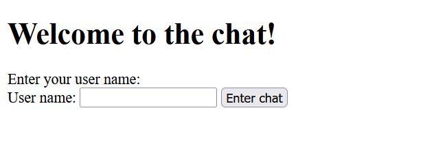
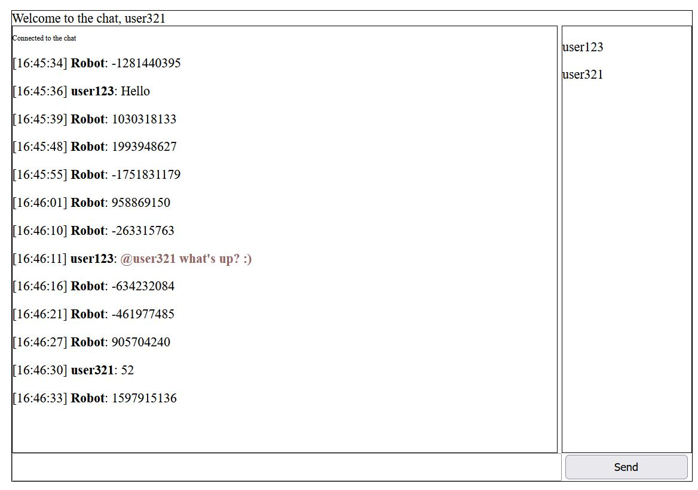

# Chat
Chat App with websocket from JavaEE and with a chat robot, which sends random numbers to the chat.

# Installation and Start
- Download websocket_chat.war file
- Put this file to your server webapps folder (e.g under *C:\Program Files\apache-tomcat-9.0.11\webapps*)
- Start up your server
- Open your browser and go to **http://localhost:8080/websocket_chat/rest/chat**

# Using chat
Start page:

Chat page:

- Write your messages and send them using button "Send".
- Leave message input field empty to send a random number to the chat.
- The chat robot sends random numbers to the chat in a random amount of seconds.
- To send a private message to a user from the chat, use *@user_name*
